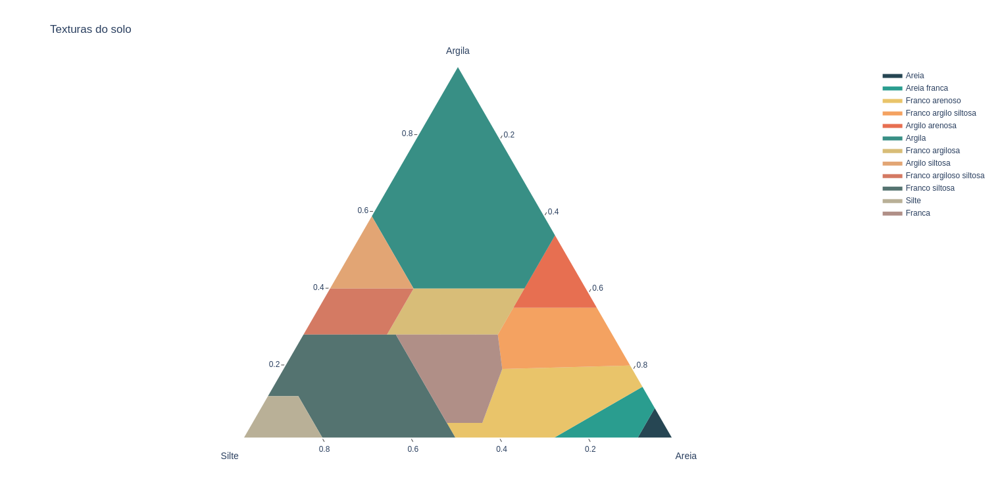

# Diagrama ternário das texturas do solo
Aqui você vai encontrar os dados e os métodos para plotar um diagrama ternário interativo, com as texturas do solo, usando Python e a biblioteca de visualiazação de dados Plotly. Os dados estão no formato .csv e contém as proporções necessárias para preencher as áreas do diagrama referentes a cada textura. Aqui também tem dois exemplos para você brincar e alterar de acordo com suas necessidades: um em formato Python(.py) e outro em IPython(.ipynb).

